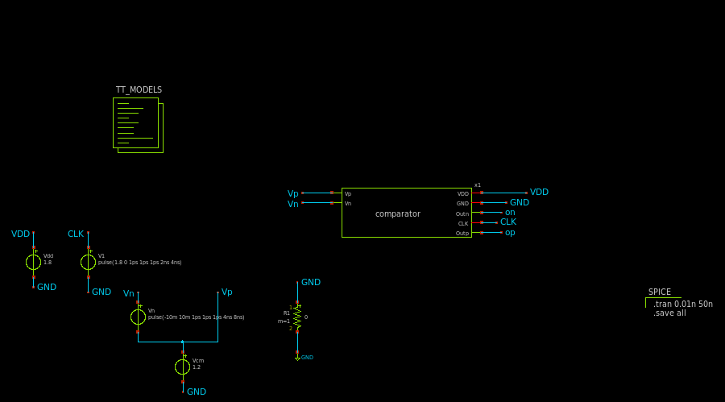
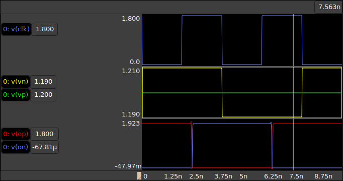

# CMOS dynamic Comparator
This project is the implementation of a optimised strong arm latch using Skywater 130nm technology.
The purpose of this project is to test the open source tools provided with the PDK and to go through all the steps of the analog design flow.

## CMOS Comparator
The schematic of the comparator test bench was deisgned as follows :

## Simulation
We simulated the comparator with reference at the negative input and a pulse at the positive input. The output is a digital signal that triggers at every clock pulse depending on the input amplitude.

